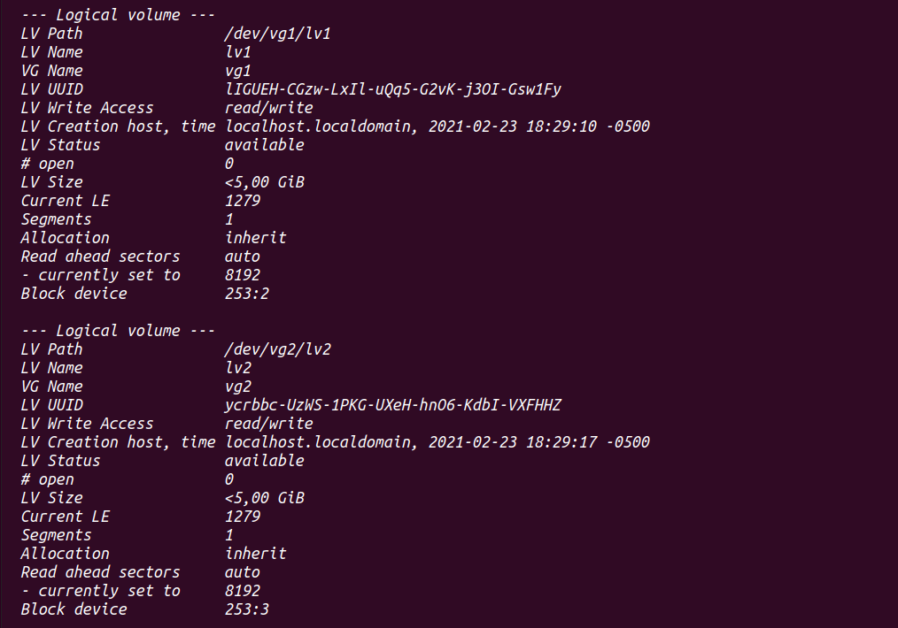

## Exam

### 1.
Creating VMs

### 2.
exam user

### 3.
OpenJDK8

### 4.
hadoop

### 5.
unzip hadoop

### 6.
simlink

### 7.
users hadoop, hdfs, yarn

### 8.
additional 5G disks

### 9. 
physical volumes

### 10.
LVM groups with physical volumes

### 11.
LVM

### 12.
file system

### 13.
mounting file systems

### 14.

### 15-16.
VM1 namenodes

### 17-20.
datanodes and nodemanager dirs

### 21.
ssh

### 22.
/etc/hosts

### 23.
downloading files and chenges

### 24.
HADOOP_HOME /etc/profile

### 25.
VM1 formatting HDFS

### 26.
starting namenode and resourcemanager

### 27.
starting datanode and nodemanager

### 28.
open ports

### 29. 
systemd services

