## Lesson1 HW

### 0. Установить вторую ВМ с доступом только до первой ВМ

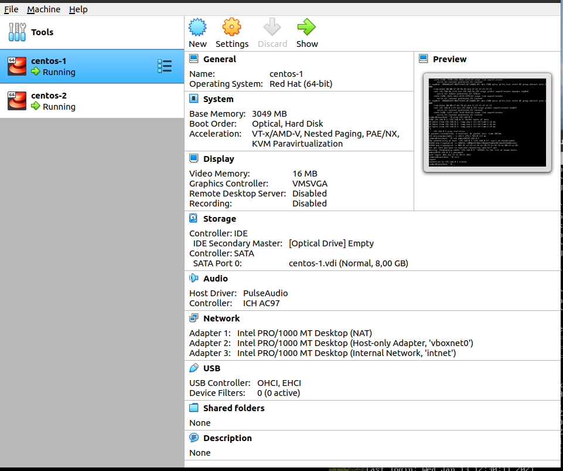

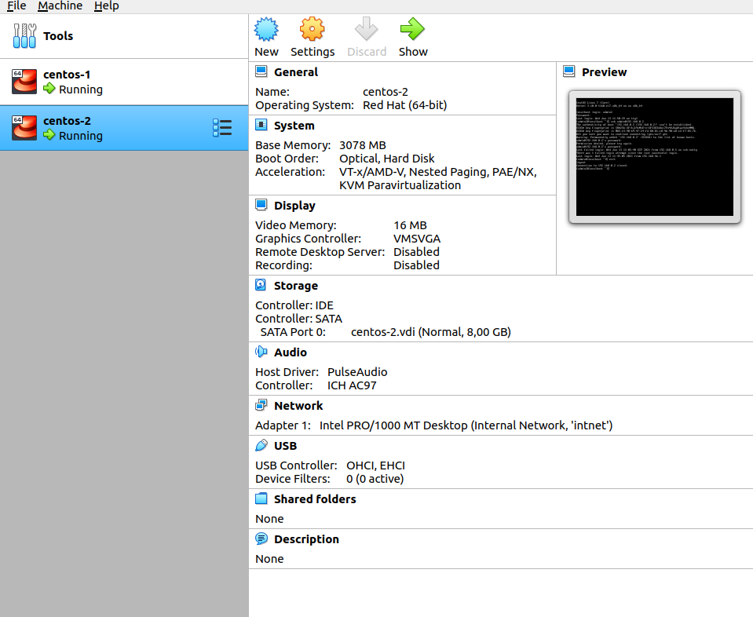
    
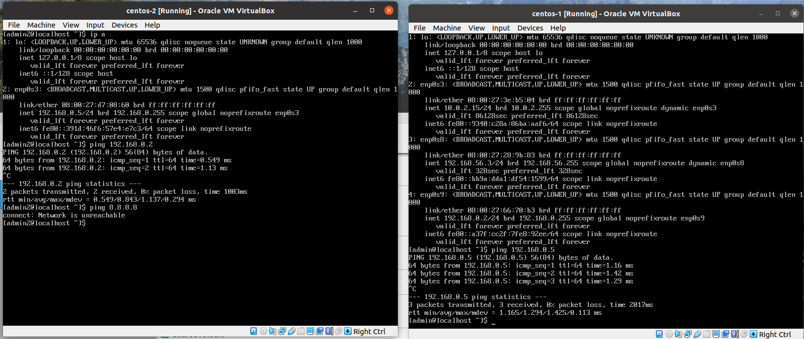
ip a commands for VM1 and VM2

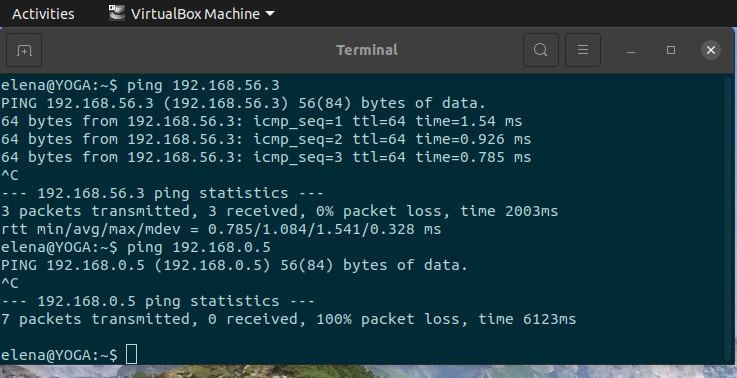
 ping from host mashine

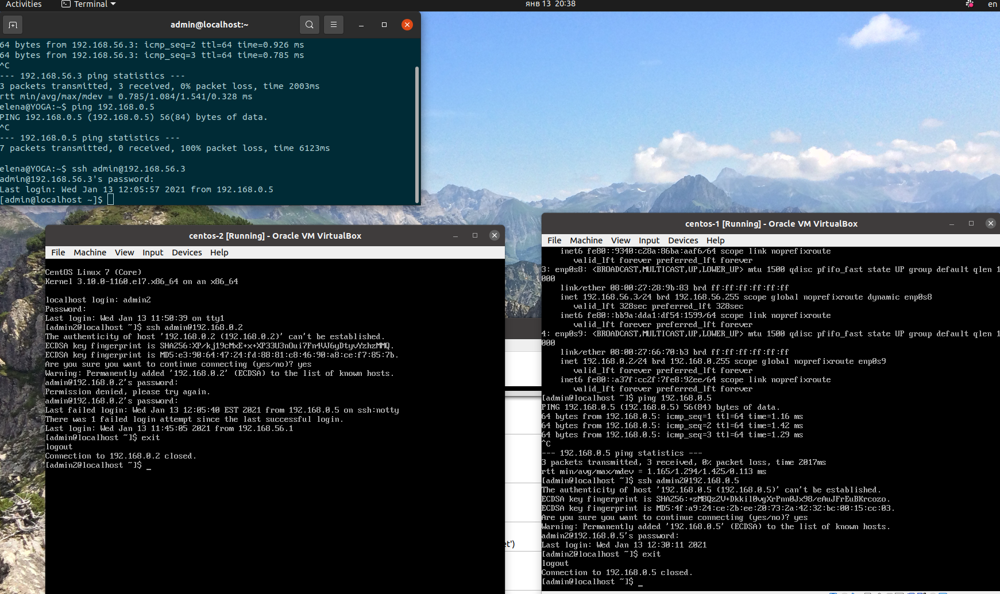
ssh VM1->VM2 and VM2->VM1

### 1. Используя команду ls, необходимо вывести на экран все файлы, которые расположены в секционных директориях /usr/share/man/manX и содержат слово "config" в имени. Одним вызовом ls найти все файлы, содержащие слово "system" в каталогах /usr/share/man/man1 и /usr/share/man/man7

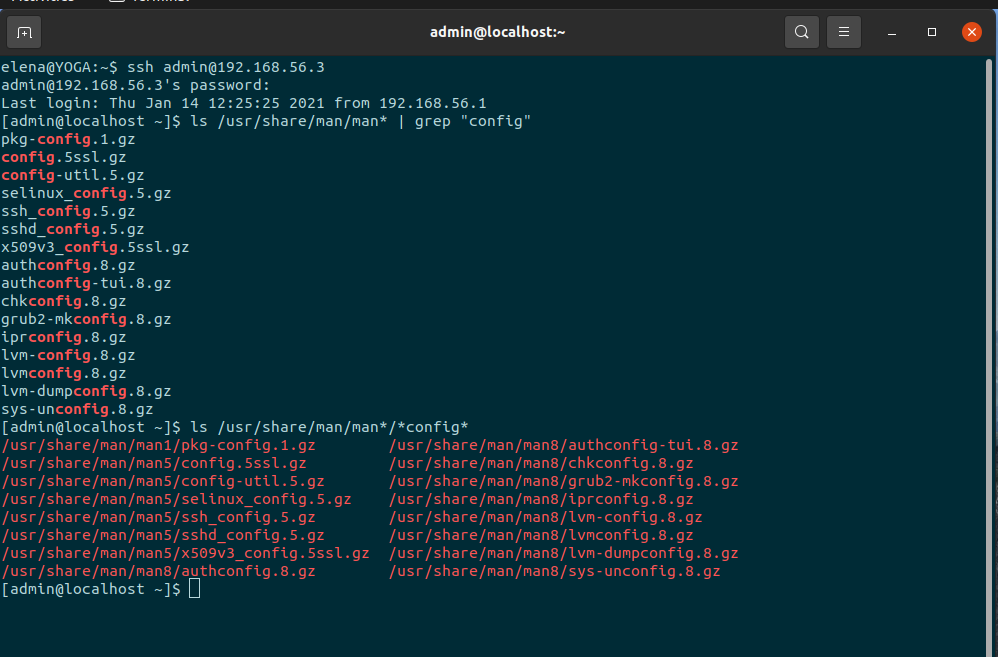
find config files

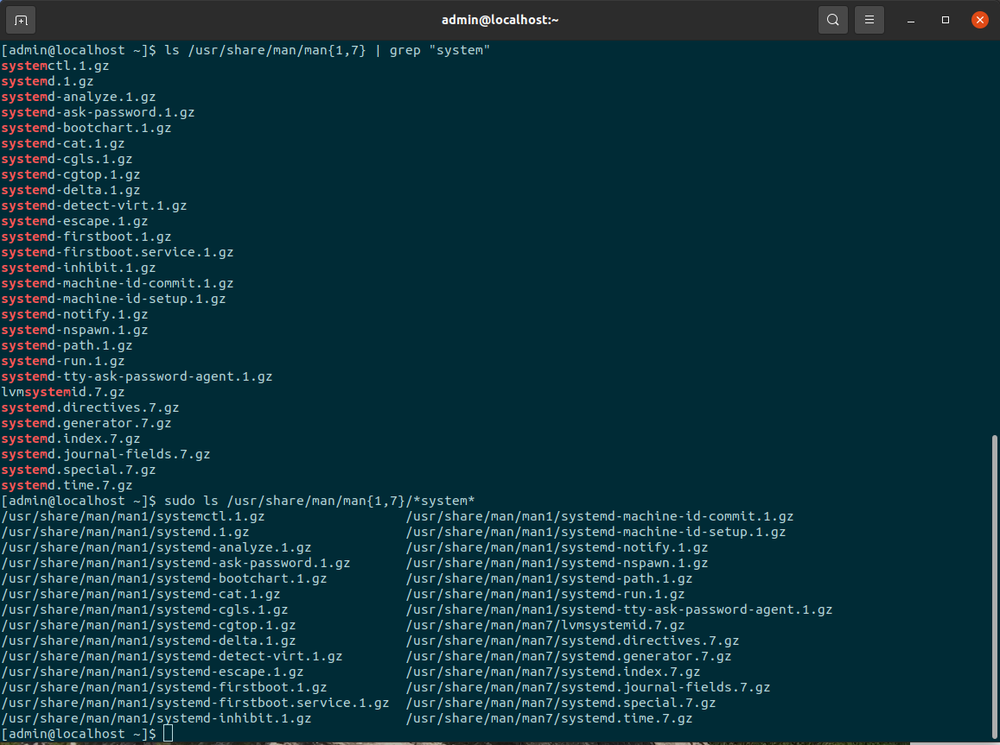
find system files

### 2. Найти в директории /usr/share/man все файлы, которые содержат слово "help" в имени, найти там же все файлы, имя которых начинается на "conf".

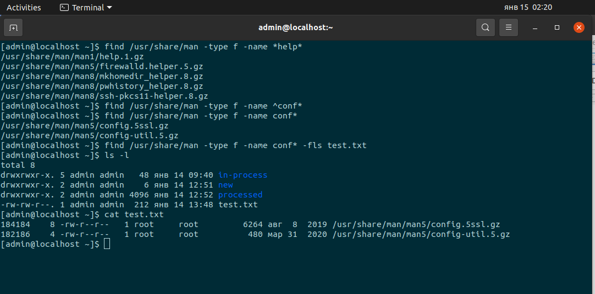

с файлами, найденными командой find не запуская других команд можно выполнить: 

    -delete  -  удаление файлов 
    -exec  -  выполнение команд
    -fprint/ -fls   -   печать\вывод в файл

### 3. При помощи команд head и tail, выведите последние 2 строки файла /etc/fstab и первые 7 строк файла /etc/yum.conf

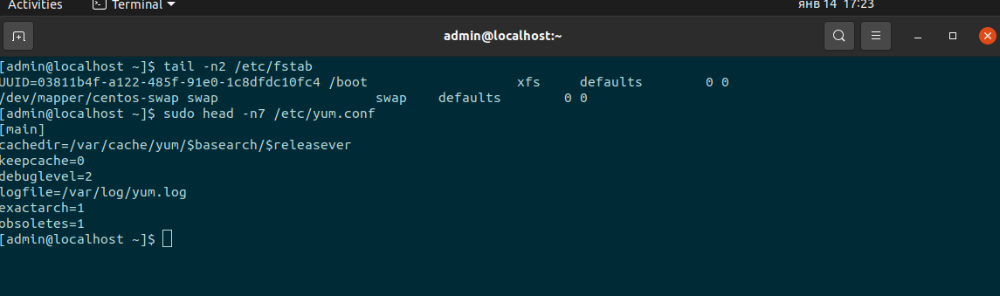

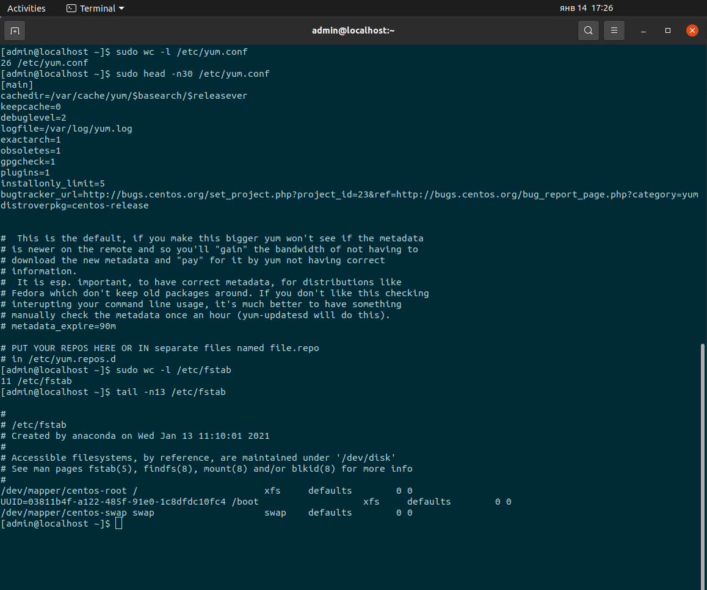
если запросить больше строк, чем есть в файле - выводится метаинформация?

### 4. Переименование файлов

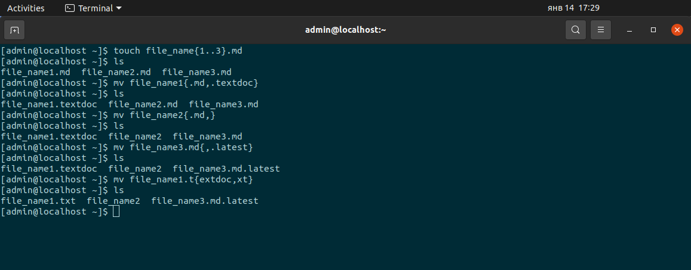

### 5. Возвращение в домашнюю директорию

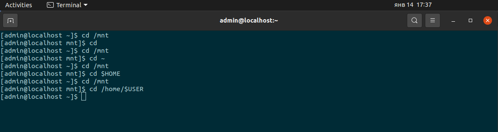

### 6. 

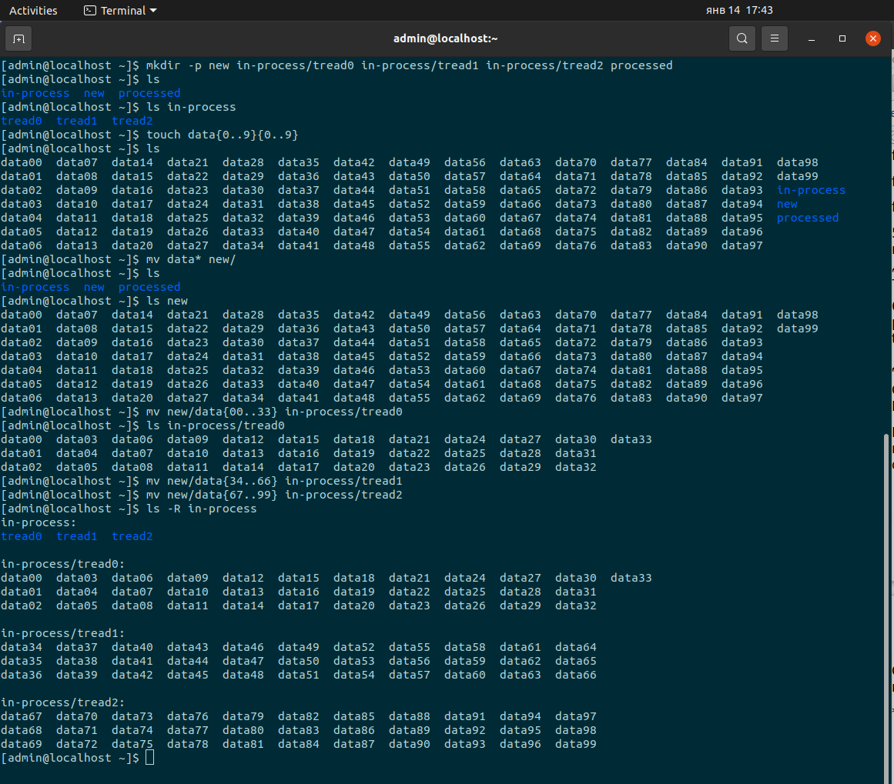
создание\перемещение файлов

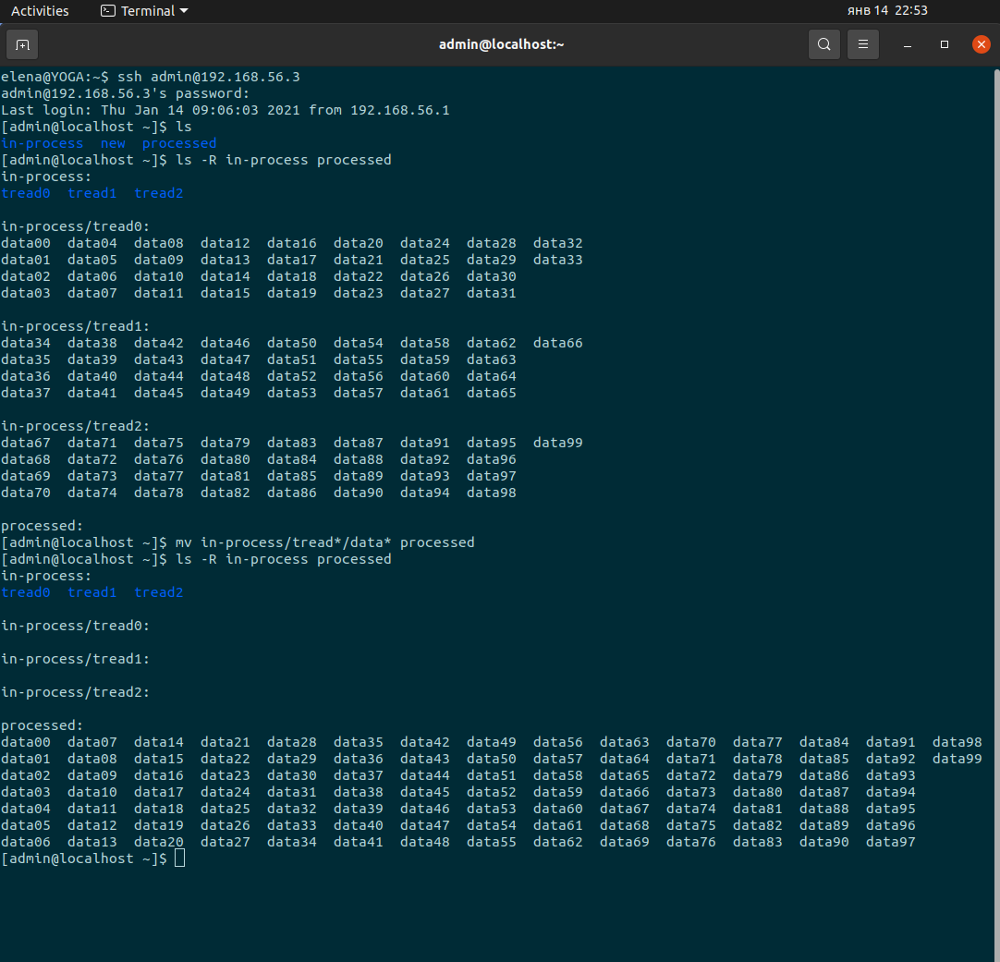
перемещение файлов

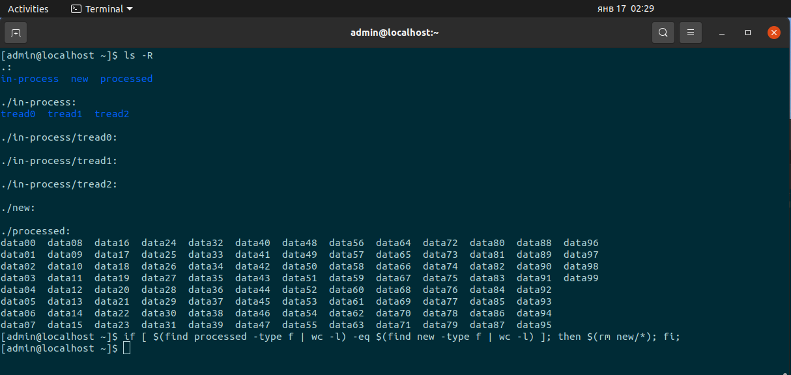
сравнение\удаление