## Lesson11-12 HW

### 1.
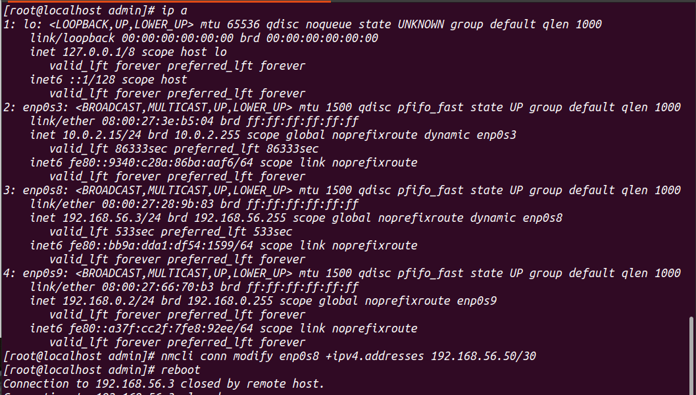
ip a with one ip address and adding second ip

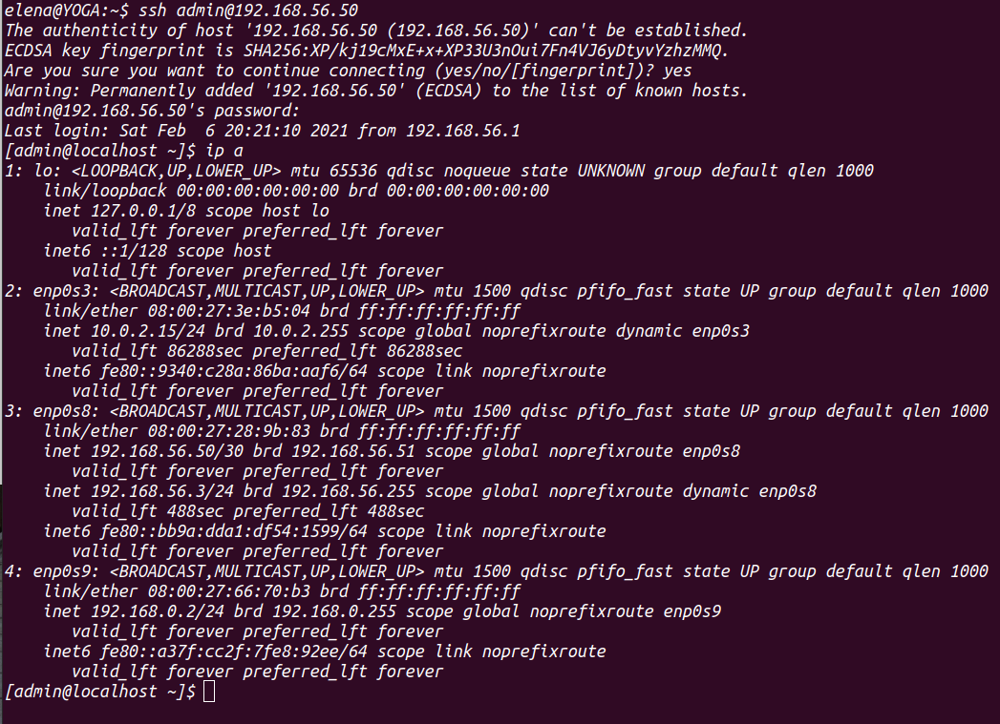
ssh connection to second ip + ip a

### 2. 
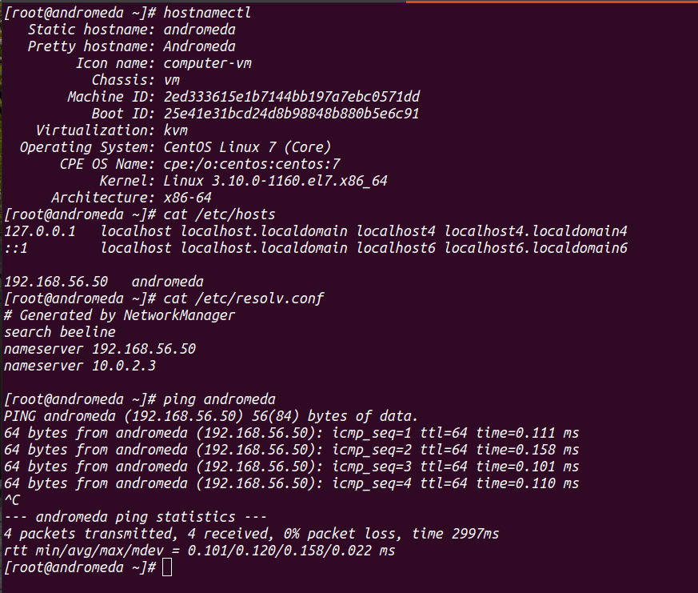
changed hostname and ping

### 3.
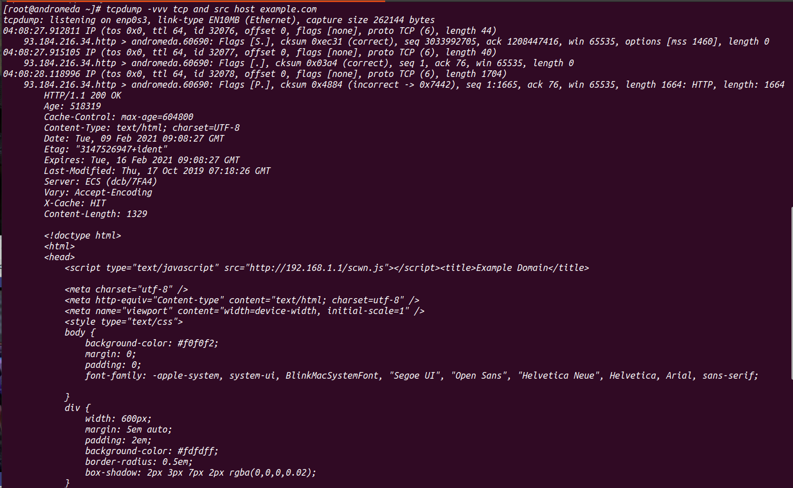
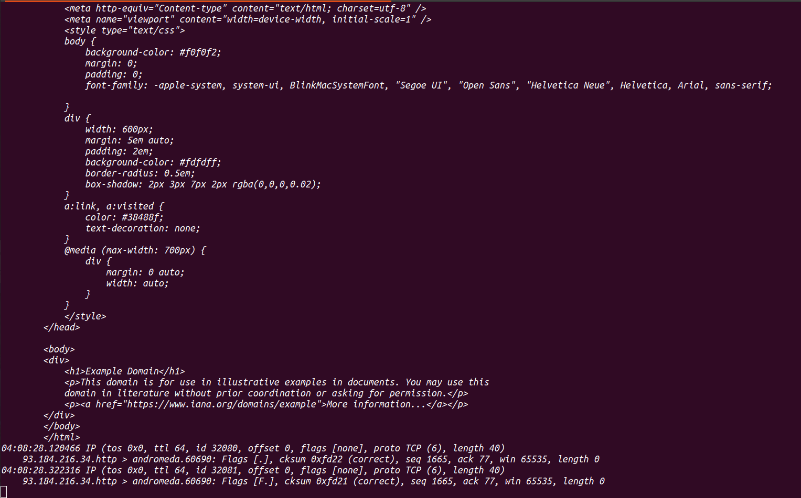
tcpdump got messages (curl to example.com)

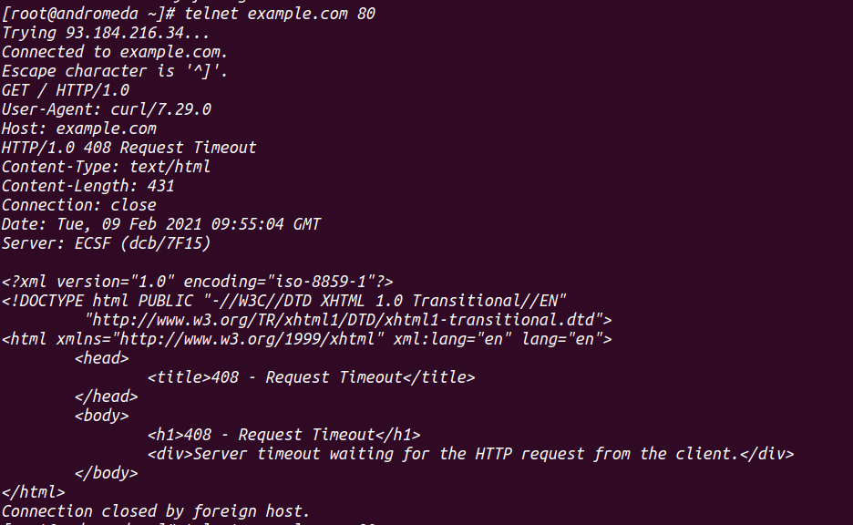
telnet example.com

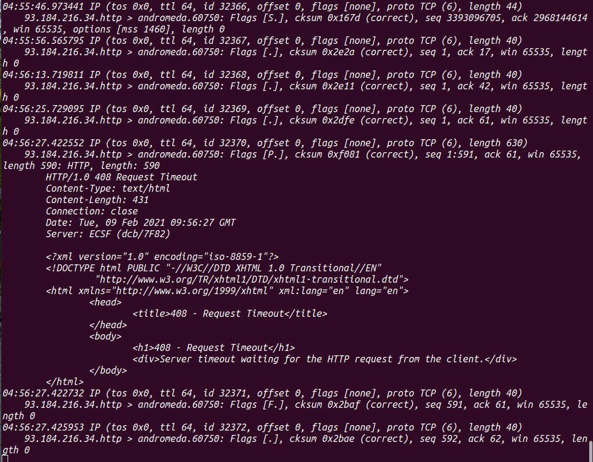
tcpdump got messages (telnet)

### 4.
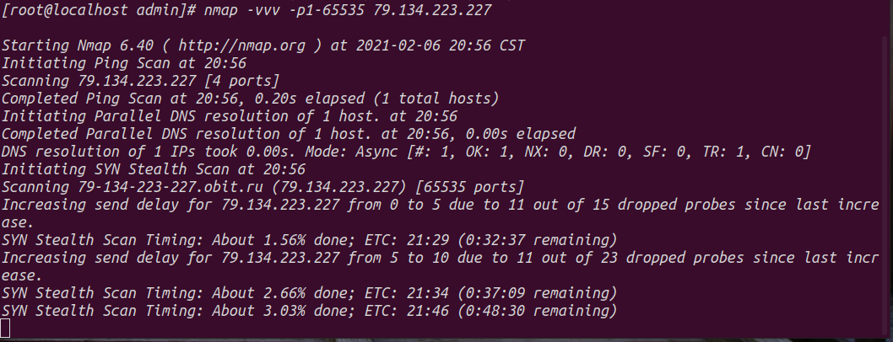
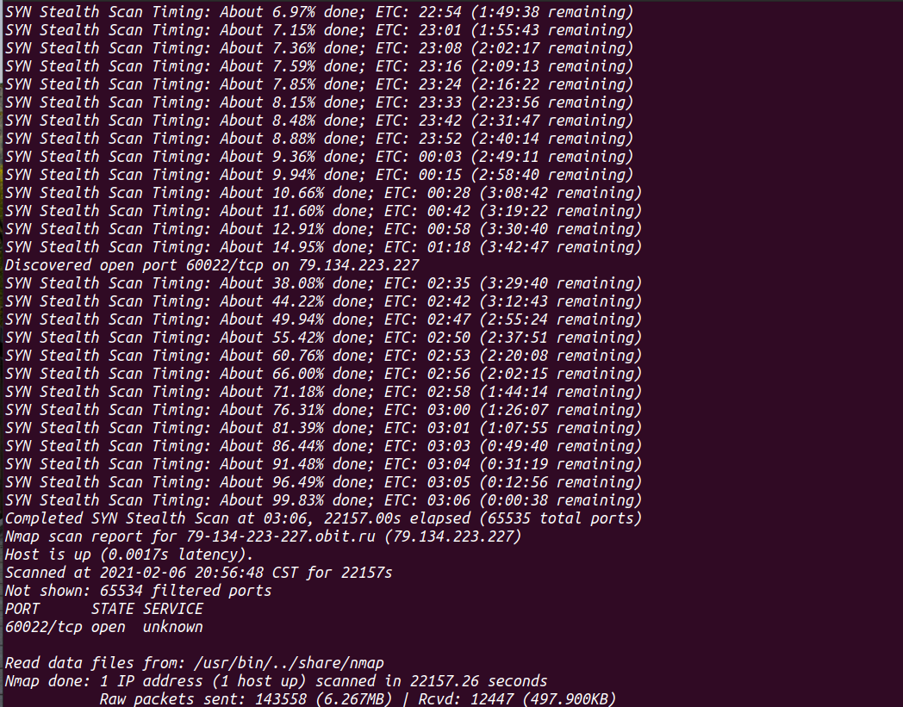
nmap scanning ports

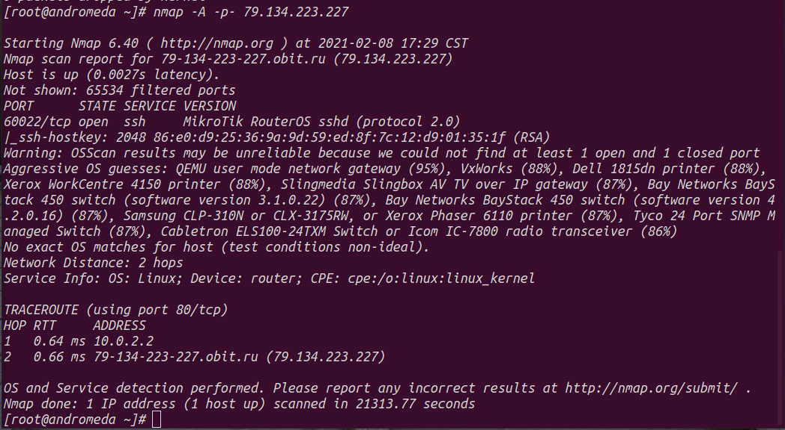
aggressive nmap scanning, 60022 - ssh port

### 5.
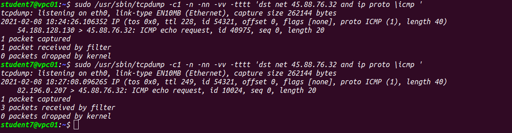
icmp message 
