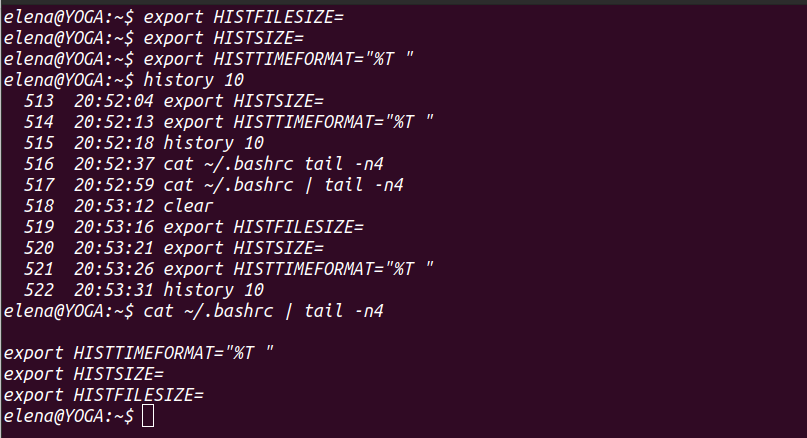
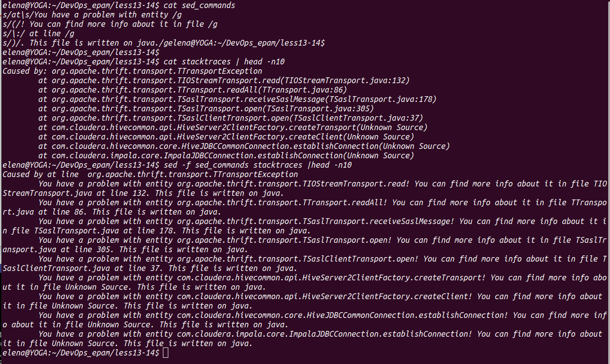
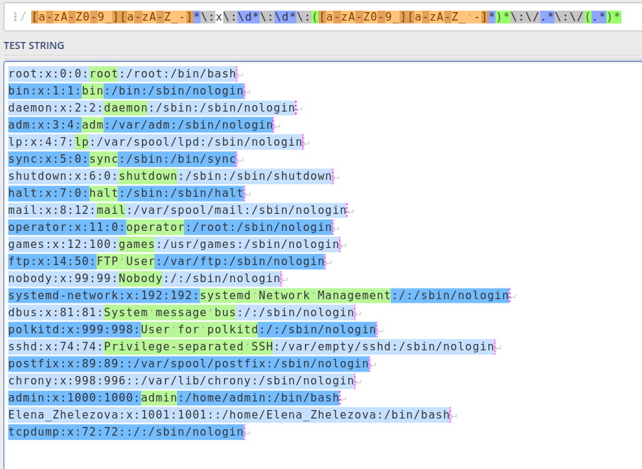

## Lesson13-14 HW

### 1.
#### 1.1 Sum running PID's
pid_sum.sh

#### 1.2 Lucky numbers
lucky_num.sh

#### 1.3 Favourite word
favorite_word.sh

#### 1.4 Sence of beauty
sence_of_beautyy.sh

#### 1.5 Unlim history

### 2. RegExp
#### 2.1 Stacktrace of JVM

sed_commands

#### 2.2 RegEx for /etc/passwd

