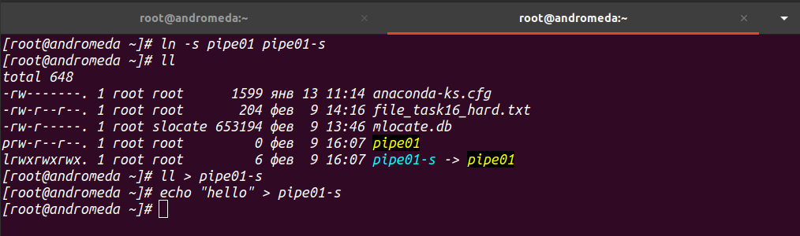

## Lesson15-16 HW

### 1.

adding docker ce repo

installing docker-ce v19.03.14

checking docker version

docker updating to last version

last yum operations

full package info

deleting docker

checking docker deletion

### 2.

moving lockate db, new file_task16

hardlink, removing file_task16

hardlink content

### 3.

pipe01

pipe01 soft link

### 4.

Unix sockets