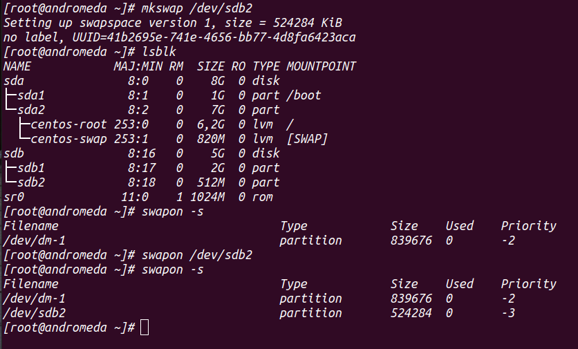

## Lesson17-18 HW

### 1.

Creating 2GB part and 512MB swap

Formatting the 2GB partition with an XFS file system

Initialize 512MB partition as swap space

Configuring the newly created XFS file system mount at /backup

Configuring to be enabled at boot

### 2. LVM

Creating 2GB partition on /dev/sdb

Initializing the partition as a physical volume
Extending the volume group of root device using your newly created PV

Extending root logical volume by 1GB

Extending root device filesystem to be able to use 
additional free space of root LV

After reboot