## Lesson19-20 HW

### 1.
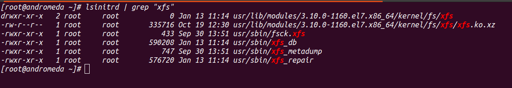
lsinitrd - utility for inspecting initrd file content
Files related to xfs filesystem:
 - xfs.ko.xz - loads kernel module
 - fsck.xfs - starts repair
 - xfs_db - starts checking and debugging
 - xfs_metadump - makes copies of partition metadata
 - xfs_repair - restores filesystem when checks are not enough

### 2.
In rescure mode all filesystems are mounted in read and write mode.
Changes would be saved.

### 3.
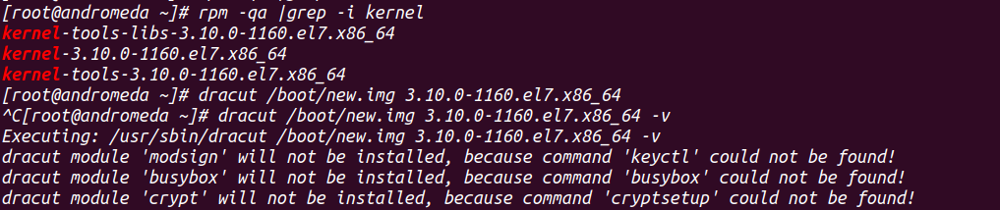
creating new initrd image

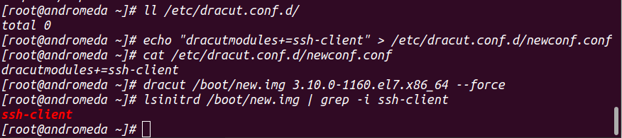
addind module in image

### 4.
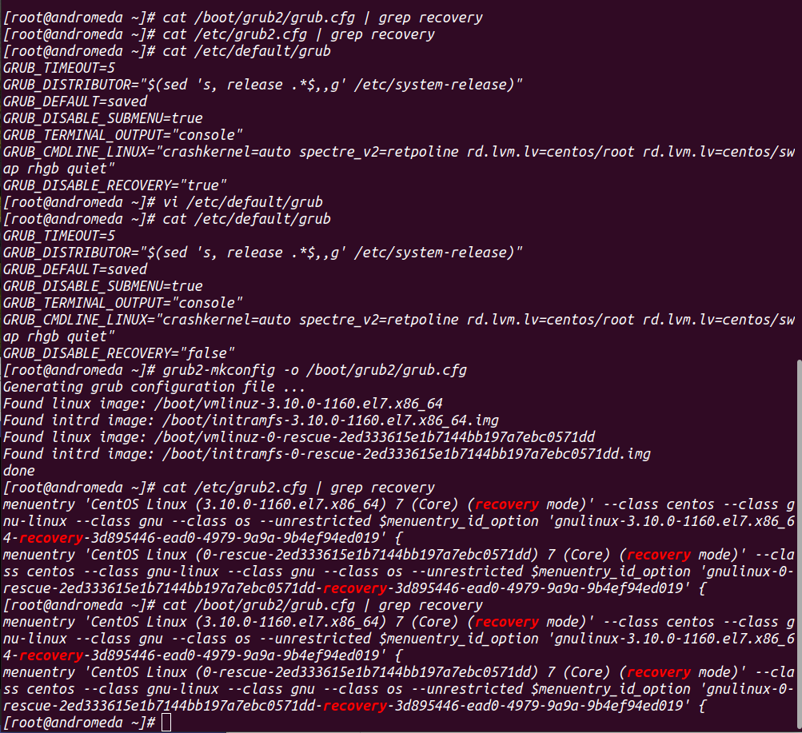
enabling recovery

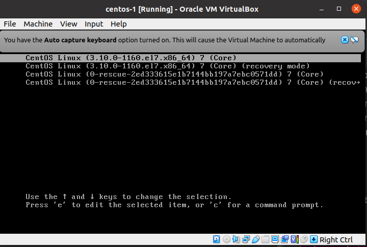

### 5.
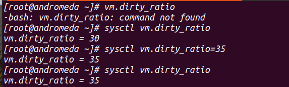
changing vm.ratio with sysctl

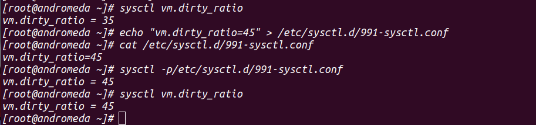
change vm.ratio using configuration file

### 6. 
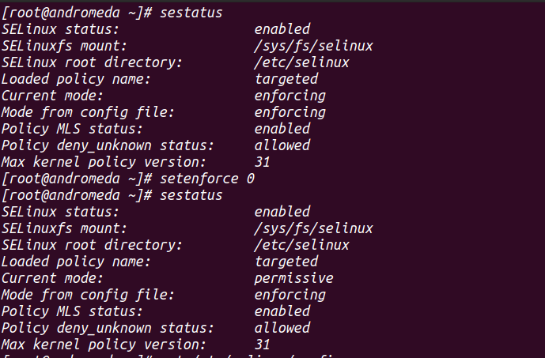
setenforce made permission mode

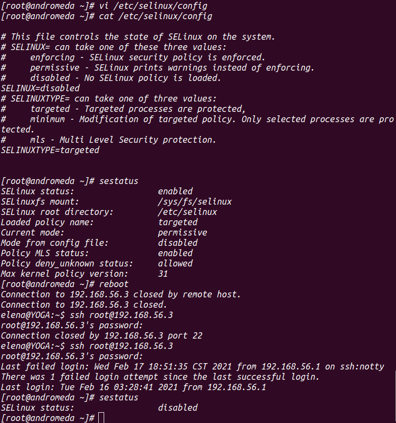
disabled with config

### 7. firewalld

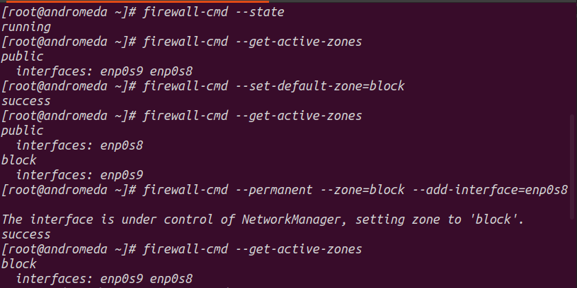
set default zone to block - block all input connections

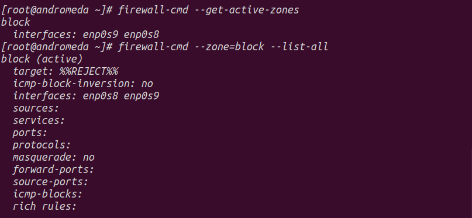

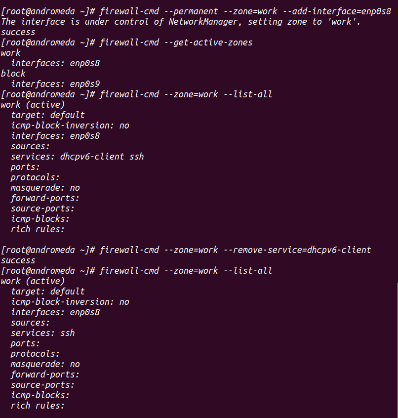
only ssh

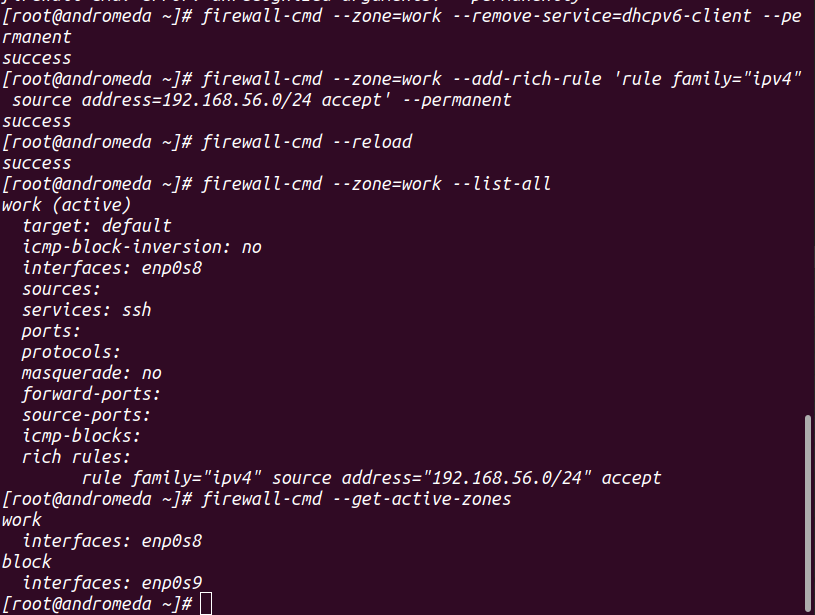
permanent adding rules

### 8. iptables

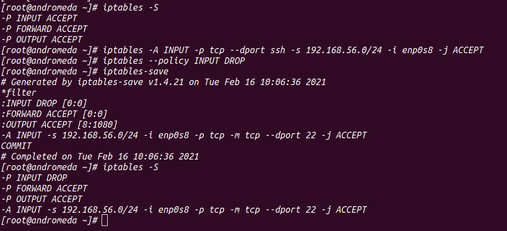
adding rules