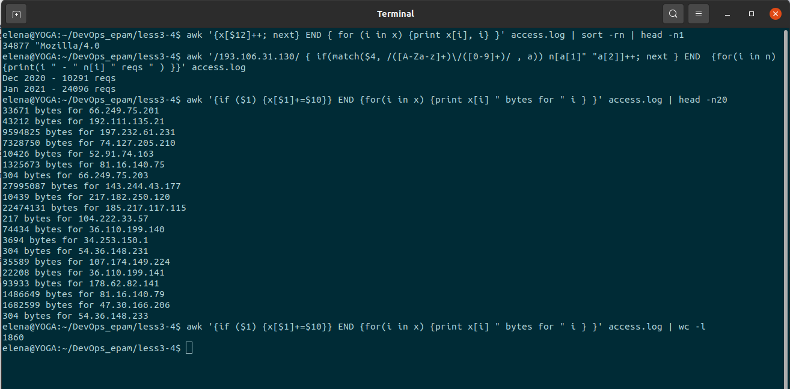
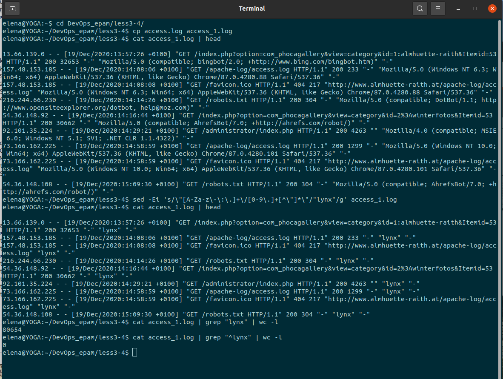
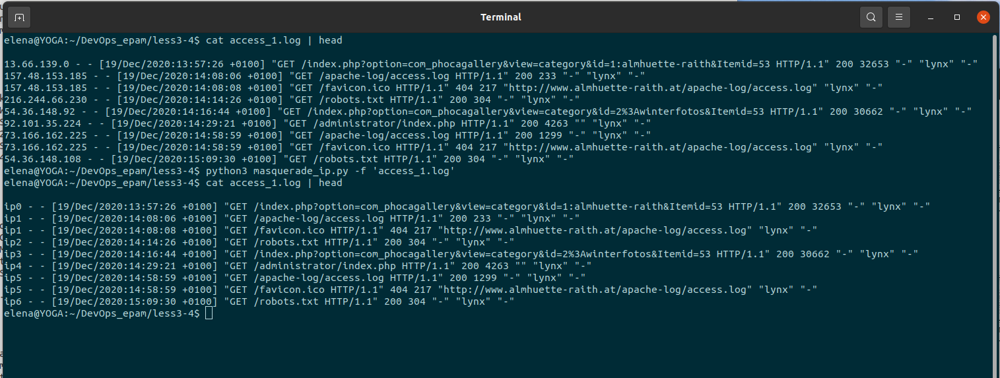

## Lesson3-4 HW

### 0. awk puzzles

* most frequent browser
* number of requests per month for 193.106.31.130
* total amount of data which server has provided for each unique ip

### 1.  sed

* change all user agents to "lynx"

  
* masquerade all ip addresses
