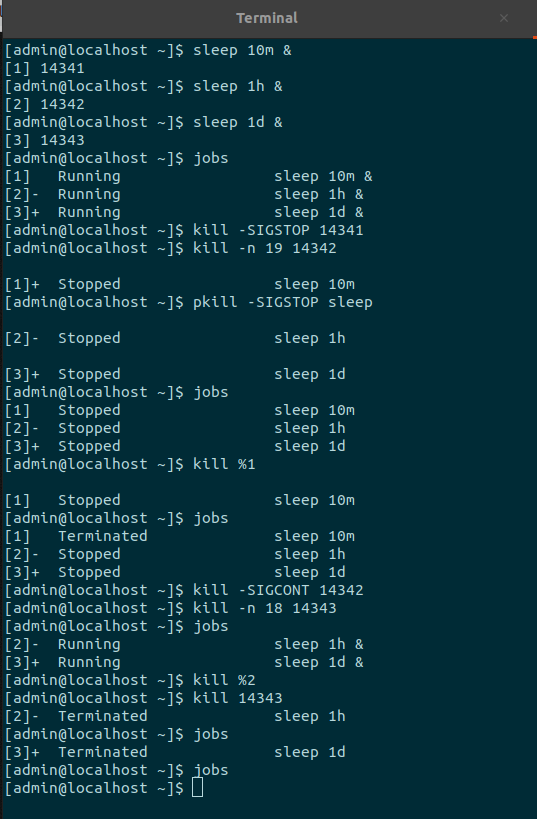
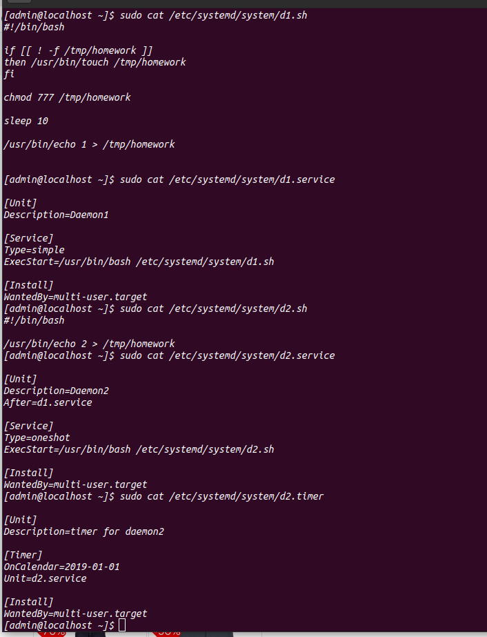
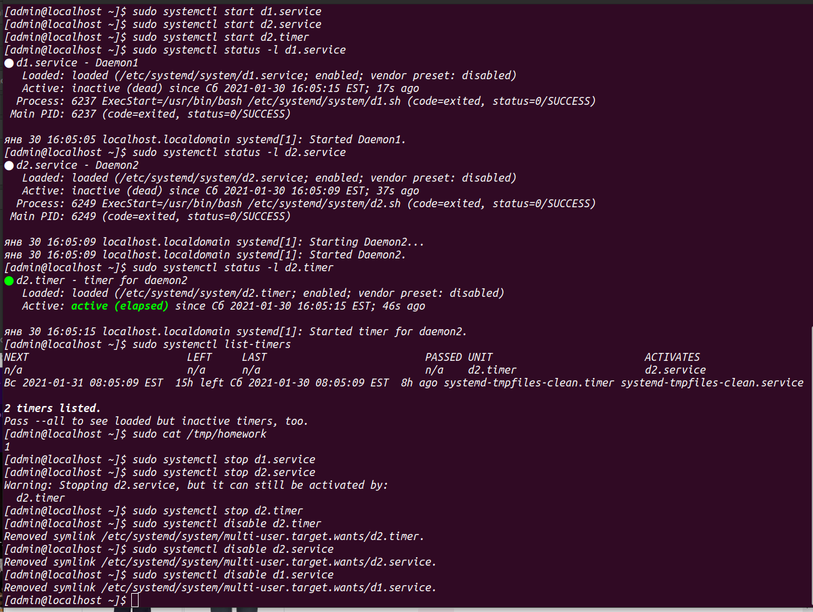
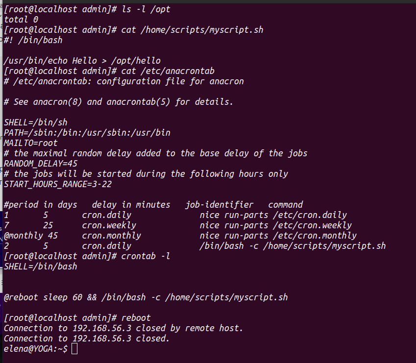
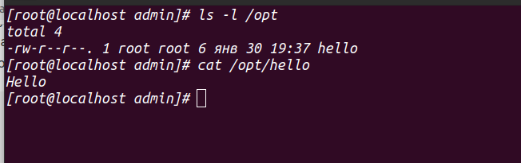
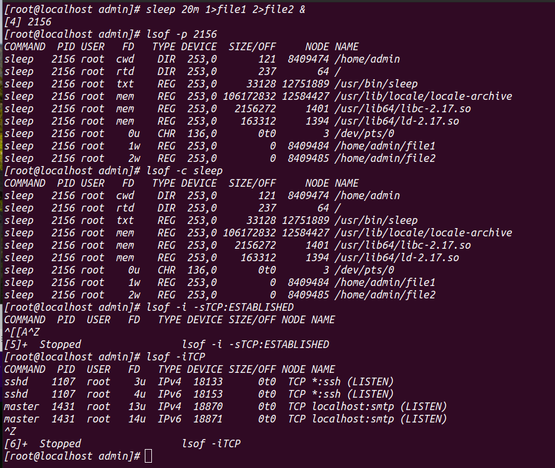

## Lesson5-6 HW

### 1. Processes

SIGSTOP / SIGCONT / kill

### 2. systemd

systemd daemons

daemons running

### 3. cron/anacron

cron / anacron jobs

cron job's working result

### 4. lsof

