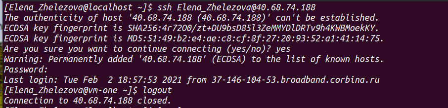
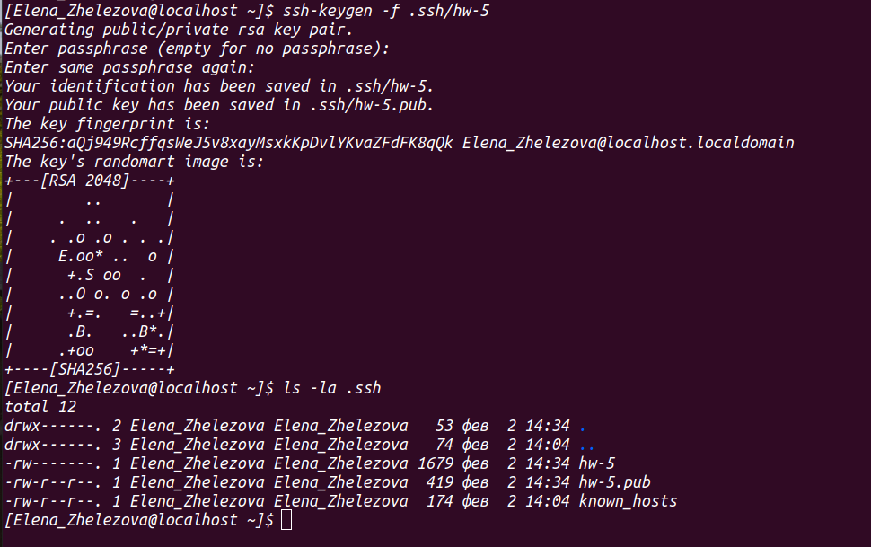
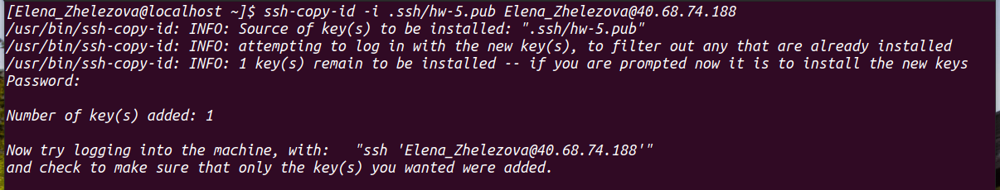
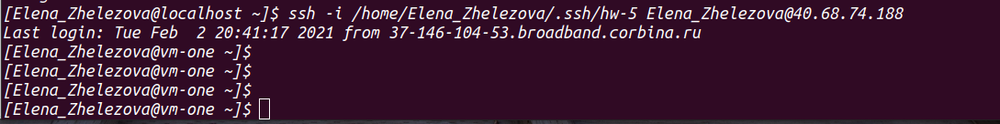
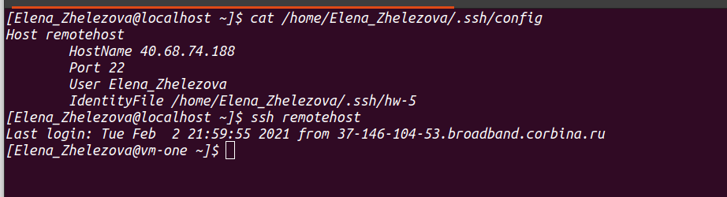
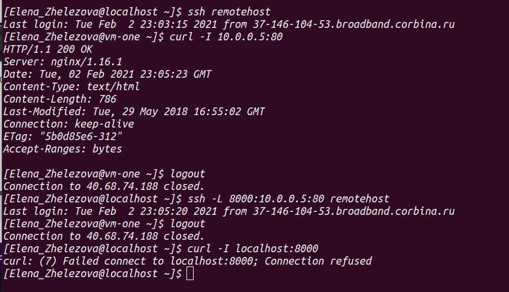
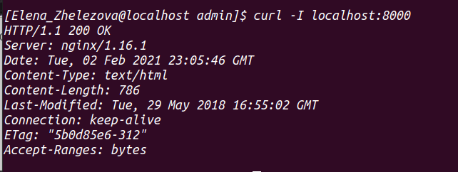
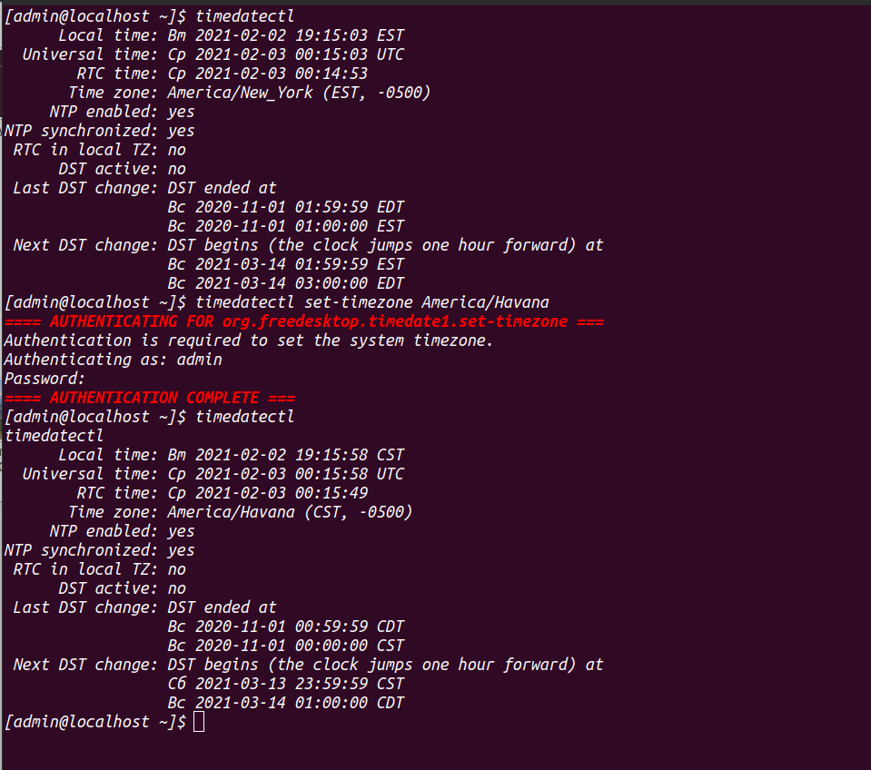
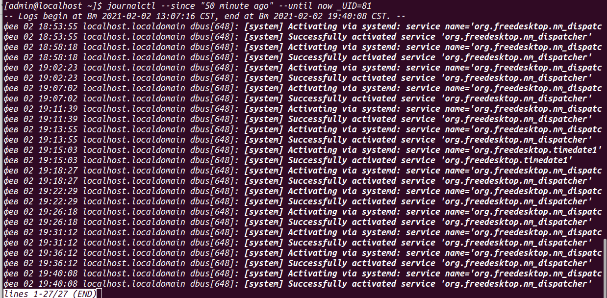

## Lesson9-10 HW

### 1.

ssh with password 

generating key pair with hw-5 name

copy pub key to remotehost

ssh without password

ssh config

webserver from localhost and port forwarding

reaching webserver from VM localhost

### 2. 

relocate

systemd journal messages recorded in the last 50 minutes
and started with user id 81

